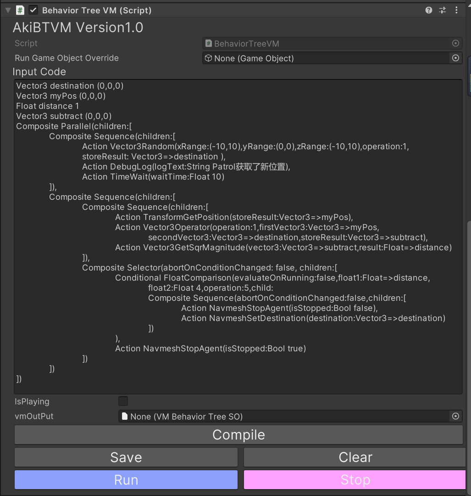

# AkiBTVM行为树虚拟机简介 Intro Of AkiBTVM


AkiBTVM是[爱姬kurisu](https://space.bilibili.com/20472331)面向行为树[AkiBT](https://github.com/AkiKurisu/AkiBT)设计的运行时编译方案。你可以在游戏运行时对行为树进行热更新,并且使用者无需了解结点的详细内容、无需完整项目便可以进行脚本编写。

AkBTVM is a solution for runtime compile, designed for Behavior Tree [AkiBT](https://github.com/AkiKurisu/AkiBT) and supported by [AkiKurisu](https://space.bilibili.com/20472331).You can hot-update the Behavior Tree while the game is running, and users can write scripts without knowing the details of the nodes or the complete project.
#

## AkiBTVM特点 Features Of AkiBTVM
* 使用特殊的AkiBTCode编写AkiBT行为树
* Write AkiBT Behavior Trees using the special AkiBTCode
* 运行时随时进行编译，并可以在Editor中导出BehaviorTreeSO
* Compile at any time during runtime and export BehaviorTreeSO in the Editor
* 可以提前转为IL中间代码(Json-like)
* Can be converted to IL intermediate code (Json-like) in advance
* 编译器可以完全与项目分离,使用者无需了解项目中特殊结点的详细内容例如方法实现
* The compiler can be completely separated from the project, and the user does not need to know the details of the special nodes in the project, such as method implementation
#

## 使用方式How To Use

  


### Chinese Version

1. 使用AkiBTCompiler(Tools/AkiBTVM)生成一个TypeDictionary
2. 创建GameObject,挂载BehaviorTreeVM组件
3. 在编辑器中输入AkiBTCode
4. 点击Compile编译为行为树或者在运行时使用BehaviorTreeVM的```Compile(string vmCode)```方法
5. 点击Run直接运行。
6. 点击Save将编译出的行为树保存为BehaviorTreeSO

### English Version

1. Use AkiBTCompiler (Tools/AkiBTVM) to generate a TypeDictionary
2. Create a GameObject and mount the BehaviorTreeVM component
3. Enter AkiBTCode in the editor
4. Click Compile to compile a behavior tree or using  ```Compile(string vmCode)``` method in BehaviorTreeVM at runtime
5. Click Run to run directly.
6. Click Save to save the compiled behavior tree as BehaviorTreeSO
  
#
## AkiBTCode解释 Explaination for AkiBTCode

由于AkiBT的序列化依赖于```UnityEngine.SerializeReferenceAttribute```的序列化,热更新方案为模仿该序列化的格式从而反序列化为AkiBT行为树。

Since the serialization of AkiBT depends on the serialization of ```UnityEngine.SerializeReferenceAttribute```, the hot update scheme is to imitate the format of the serialization and deserialize it into an AkiBT behavior tree.

AkiBTIL即为使用```UnityEngine.SerializeReferenceAttribute```序列化后的Json格式文件,它额外包含了AkiBT行为树的SharedVariables即共享变量,同样也是基于上述Attribute进行序列化。因此我们可以通过修改AkiBTIL来修改反序列化后的结果。但AkiBTIL存在一个人工编写上的困难之处,以下是一个例子：

AkiBTIL is a Json format file serialized using ```UnityEngine.SerializeReferenceAttribute```, which additionally includes the SharedVariables of the AkiBT behavior tree, that is, shared variables, which are also serialized based on the above Attribute. So we can modify the deserialized result by modifying AkiBTIL. But AkiBTIL has a difficulty in manual writing, the following is an example:
```
{
  "variables": [
    {
      "rid": 1000
    },
    {
      "rid": 1001
    }
  ],
  "root": {
    "rid": 1004
  },
  "references": {
    "version": 2,
    "RefIds": [
      {
        "rid": 1000,
        "type": {
          "class": "SharedVector3",
          "ns": "Kurisu.AkiBT",
          "asm": "Kurisu.AkiBT"
        },
        "data": {
          "isShared": false,
          "mName": "destination",
          "value": {
            "x": 0.0,
            "y": 0.0,
            "z": 0.0
          }
        }
      }
      ]
      }
}
      
```
我截取了AkiBTIL的部分片段,可以看到由于使用SerializeReference方式序列化，存储的方式为引用位置存储rid，在统一的references集合中存储实际的数据。这对于人工编写非常不便，因此我制作了一个简单的编译器从而可以使用一种更自然的语言来编写脚本即AkiBTCode。

I intercepted some fragments of AkiBTIL, and I can see that due to serialization using the SerializeReference method, the storage method is to store the rid at the reference location, and store the actual data in the unified references collection. This is very inconvenient to write manually, so I made a simple compiler to write scripts in a more natural language called AkiBTCode.

以下是使用AkiBTCode编写的行为树：

The following is a behavior tree written using AkiBTCode:
```
Vector3 destination (0,0,0)
Vector3 myPos (0,0,0)
Float distance 1
Vector3 subtract (0,0,0)
Parallel(children:[
	Sequence(children:[
		Vector3Random(xRange:(-10,10),yRange:(0,0),zRange:(-10,10),operation:1,
		storeResult: Vector3=>destination ),
		DebugLog(logText:String Patrol获取了新位置),
		TimeWait(waitTime:Float 10)
	]),
	Sequence(children:[
		Sequence(children:[
			TransformGetPosition(storeResult:Vector3=>myPos),
			Vector3Operator(operation:1,firstVector3:Vector3=>myPos,
				secondVector3:Vector3=>destination,storeResult:Vector3=>subtract),
			Vector3GetSqrMagnitude(vector3:Vector3=>subtract,result:Float=>distance)
		]),
		Selector(abortOnConditionChanged: false, children:[
			FloatComparison(evaluateOnRunning:false,float1:Float=>distance,
				float2:Float 4,operation:5,child:
				Sequence(abortOnConditionChanged:false,children:[
					NavmeshStopAgent(isStopped:Bool false),
					NavmeshSetDestination(destination:Vector3=>destination)
				])
			),
			NavmeshStopAgent(isStopped:Bool true)
		])
	])
])

```
上述行为树为AkiBT Example中的巡逻AI行为树,它每10秒会获取一个新的位置并向其移动，如果距离目标点小于2则停止

The above behavior tree is the patrol AI behavior tree in AkiBT Example, it will get a new position every 10 seconds and move to it, if the distance from the target point is less than 2, it will stop


AkiBTCode主体可分为两部分即公共变量和结点,公共变量的申明需要指明类型、名称和值。

The main body of AkiBTCode can be divided into two parts, public variables and nodes. The declaration of public variables needs to specify the type, name and value.

结点我们会跳过Root结点（因为所有行为树都从Root进入），直接从Root的子结点开始编写。

For nodes, we will skip the Root node (because all behavior trees enter from the Root), and start writing directly from the Root's child nodes.

对于结点，你需要申明其类型（名称索引,可以通过自定义TypeDictionary修改，见后文）

For a node, you need to declare its type (name index, can be modified by customizing TypeDictionary, see below)

对于不使用结点默认值的普通变量，你需要申明其名称（可以使用AkiLabelAttribute进行名称替换）并添加':'后进行赋值

For ordinary variables that do not use the default value of the node, you need to declare its name (or use AkiLabelAttribute to alter field's name) and add ':' to assign

对于结点中的共享变量，你需要额外申明其类型，如果不需要引用公共变量的共享变量则直接进行赋值，例如

For the shared variable in the node, you need to declare its type additionally. If you don’t need to refer to the shared variable of the public variable, you can assign it directly, for example

```
TimeWait(waitTime:Float 10)
```
对于需要引用的共享变量，则使用'=>'符号加上需要引用的公共变量名称，例如

For shared variables that need to be referenced, use the '=>' symbol plus the name of the public variable that needs to be referenced, for example
```
NavmeshSetDestination(destination:Vector3=>destination)
```
#

## 自定义结点名称 Custom node name

AkiBTVM的编译依赖于AkiBTCompiler提前生成的TypeDictionary,一个Json文件用于搜索结点名称和实际C#类的反射信息例如Type、Assembly、NameSpace
因此你完全可以通过修改TypeDictionary中的结点名称实现更简洁的脚本编写，例如使用中文结点名称，也许会得到下面这样的结果。

```
Vector3 目标位置 (0,0,0)
Vector3 我的位置 (0,0,0)
Float 距离 1
Vector3 差值 (0,0,0)
平行(children:[
	序列(children:[
		Vector3随机(xRange:(-10,10),yRange:(0,0),zRange:(-10,10),operation:1,
		存储变量: Vector3=>目标位置 ),
		DebugLog(Log文本:String Patrol获取了新位置),
		等待(等待时间:Float 10)
	]),
	序列(children:[
		序列(children:[
			获取位置(存储变量:Vector3=>我的位置),
			Vector3Operator(operation:1,firstVector3:Vector3=>我的位置,
				secondVector3:Vector3=>目标位置,storeResult:Vector3=>差值),
			Vector3GetSqrMagnitude(vector3:Vector3=>差值,result:Float=>距离)
		]),
		选择(abortOnConditionChanged: false, children:[
			Float比较(evaluateOnRunning:false,float1:Float=>距离,
				float2:Float 4,operation:5,child:
				序列(abortOnConditionChanged:false,children:[
					停止寻路(停止:Bool false),
					设置寻路目标(目标:Vector3=>目标位置)
				])
			),
			停止寻路(停止:Bool true)
		])
	])
])
```


The compilation of AkiBTVM relies on the TypeDictionary generated in advance by AkiBTCompiler, a Json file used to search for node names and reflection information of actual C# classes such as Type, Assembly, NameSpace
Therefore, you can achieve more concise scripting by modifying the node names in TypeDictionary.
#

## 限制 Limitation

### Chinese Version

1. 结点必须已经存在项目中(因此该方案并非代码热更新)
2. 使用者仍需了解各结点的具体变量类型和名称
3. 枚举变量被序列化为int类型,影响人工编写

### English Version

4. The node must already exist in the project (so this solution is not code hot update)
5. Users still need to know the specific variable type and name of each node
6. The enumeration variable is serialized as int type, affecting manual writing